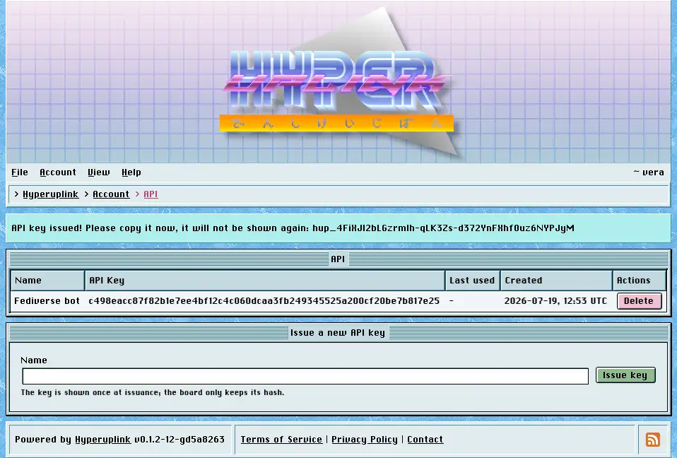

# API keys

The board speaks JSON as well as HTML, over an interface that answers on a port
of its own, 3001 unless whoever runs the board moved it. Everything you can do
while signed in, meaning reading, posting, voting, searching and reporting, can
be done through it. Signing up, signing in and signing out
cannot, because an API key takes the place of the session entirely.



## Issuing a key

_Account_ → _Security_ → _API_ lists your keys and issues new ones. A key takes
a name, which is there for telling your keys apart rather than for anything the
board does with it, and the key itself is shown exactly once, in the message at
the top of the page right after it was issued, so copy it there and then. The
board only keeps a hash, which is what the _API Key_ column shows. Nobody can
read your key back to you, the administrator included, and a key that got away
is deleted and reissued rather than recovered.

_Last used_ is updated every time a key authenticates a request, which is how
you tell a key in daily use apart from one you created in March and forgot
about. _Delete_ revokes a key immediately, and a script still holding it
collects a 401 on its next request.

## Using a key

Every request carries the key, either as a bearer token or in an `X-API-Key`
header, and a request without one answers 401 whatever it asked for, because the
API has no guest access:

```sh
curl -H "Authorization: Bearer hup_yourkeyhere" \
  http://board.example:3001/session
```

That call answers with the account the key belongs to, which makes it the first
call to make when you're checking whether a key works at all. The routes mirror
the pages, address for address, so the front page is `/`, a topic is
`/_general/announcements/welcome-to-the-board` and a profile is `/~sysop`,
exactly as they read in the browser. The front page call lists every category
and forum you may read together with their ids, and that is where the id for
starting a topic comes from:

```sh
curl -X POST http://board.example:3001/new \
  -H "Authorization: Bearer hup_yourkeyhere" \
  -H "Content-Type: application/json" \
  -d '{"name": "Hello", "text": "Written with curl.", "forum_id": "<id>"}'
```

The board answers with where the topic now lives. A key acts as you, it reads
what you may read and writes where you may write and nothing beyond that.
Handing a key to a script, however, hands it your account, and it deserves the
same amount of thought as handing over your password.

The page itself: [Account → Security → API]({{ hrefTo "account/api" }})
