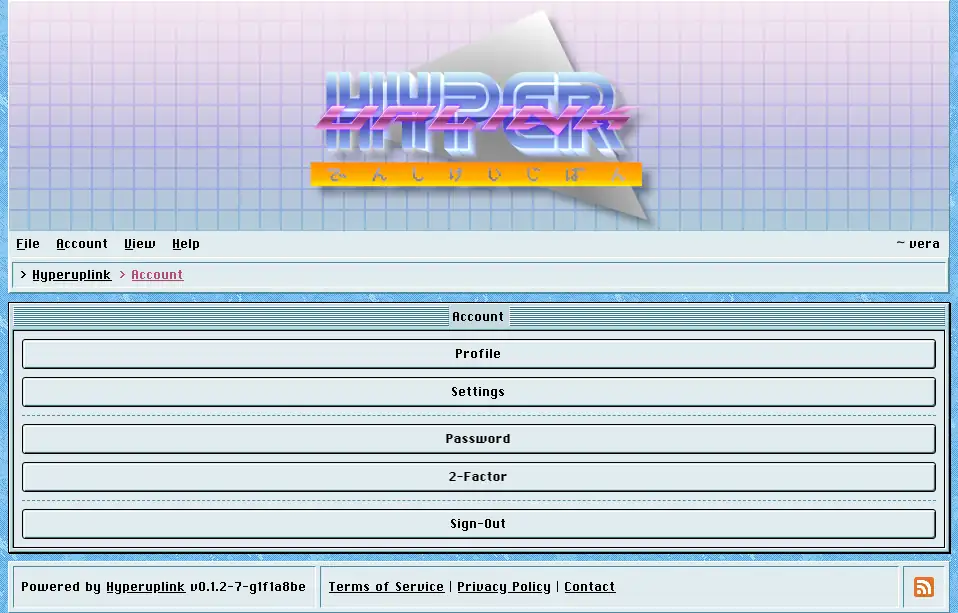

# Account

The _Account_ menu holds everything that concerns your own account, and the
account page itself is a plain index of the same entries.

- [Profile]({{ manual "account/profile" }}) is your picture, your signature and
  whether you want to hear about replies.
- [Settings]({{ manual "account/settings" }}) is your timezone.
- [Password]({{ manual "account/password" }}) changes your password.
- [2-Factor]({{ manual "account/twofactor" }}) turns two-factor authentication
  on and off.
- [API]({{ manual "account/api" }}) issues the keys that let scripts use the
  board on your behalf.

The _View_ menu belongs to your account as well, even though it has no page of
its own. Its three toggles, _Banner_, _Footer_ and _Profile Pictures_, are
stored against your account rather than against your browser. They follow you to
whatever machine you sign in from and they change nothing for anyone else. They
exist because not everyone wants a banner the size of a poster, and because
turning profile pictures off makes a busy topic considerably shorter.

The page itself: [Account]({{ hrefTo "account" }})
