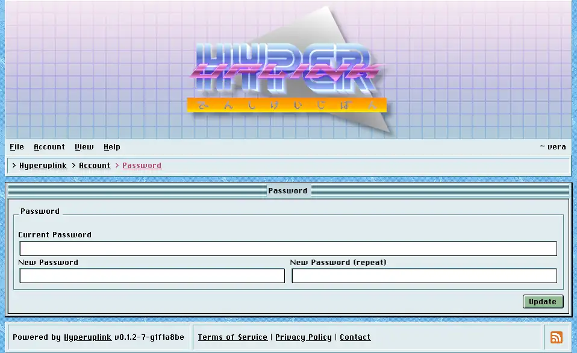

# Password

Changing your password takes the current one plus the new one twice, and the
current one is asked for so that a browser someone left signed in cannot be used
to lock its owner out.

Where you have [two-factor authentication]({{ manual "account/twofactor" }})
switched on, the form asks for a current six-digit code as well, which closes
the same door from the other side. A session on its own is **not** enough to
change the password.

Passwords are stored hashed with _Argon2id_, and nobody with a copy of the
database reads them back out. The board itself has no way of telling you what
your old password was either.

The page itself: [Account → Security → Password]({{ hrefTo "account/password" }})
