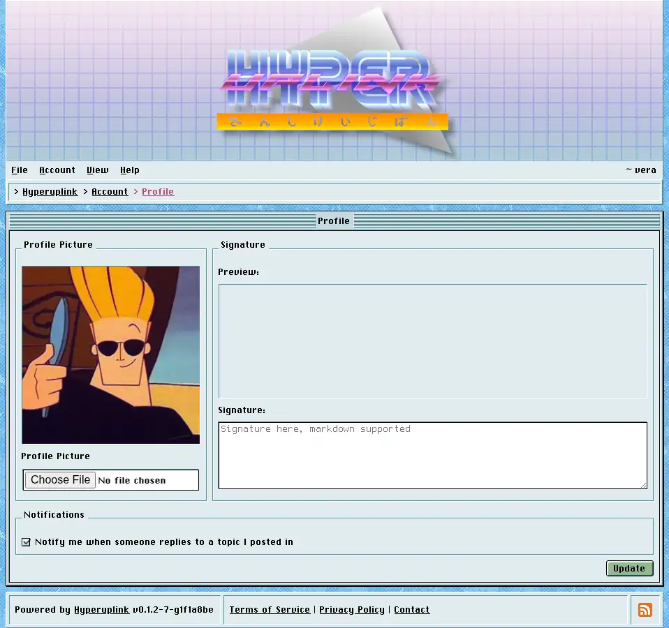

# Profile

Your profile is what everyone else sees when they click your name, and this page
is where you set it.

## Profile picture

The picture field only appears where the administrator enabled profile pictures
in [Profiles]({{ manual "admin/board/profiles" }}), and what you may upload, how
large it may be and what it gets converted to are all set there. Until you
upload one you get the board's default avatar.

## Signature

The signature is appended to every post you write, it is _Markdown_ like the
posts themselves, and the preview above the field shows what it looks like once
rendered. Keep in mind that it is repeated underneath every single post you
make, and what reads as witty once tends to read differently on the fortieth
reply of a long thread.

## Notifications

_Notify me when someone replies to a topic I posted in_ decides whether the
board tells you about new replies in threads you wrote in, whether you started
them or only replied to them. It is on by default, it applies per account rather
than per thread, and switching it off stops all of them.

Notifications go to the address you signed up with, over email or over XMPP
depending on which of the two it is, and they only go anywhere at all where the
administrator configured [delivery]({{ manual "admin/comms" }}). A board with
nothing configured sends nothing, and this checkbox then decides nothing.

The page itself: [Account → Profile]({{ hrefTo "account/profile" }})
