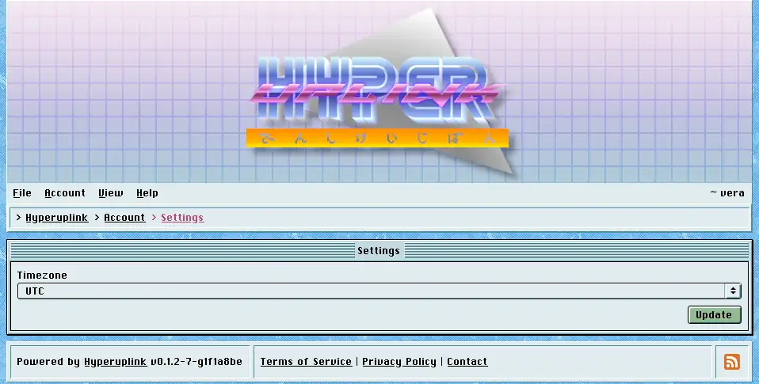

# Settings

Settings holds your timezone. The board stores every timestamp in UTC and
renders it in whatever you pick here. The dates on posts, the join dates on
profiles and the end date you gave a poll are all read in your own time rather
than in the server's.

A new account starts on UTC, which is correct for exactly the people who happen
to live on it, so this is worth setting once and then forgetting about.

The page itself: [Account → Settings]({{ hrefTo "account/settings" }})
