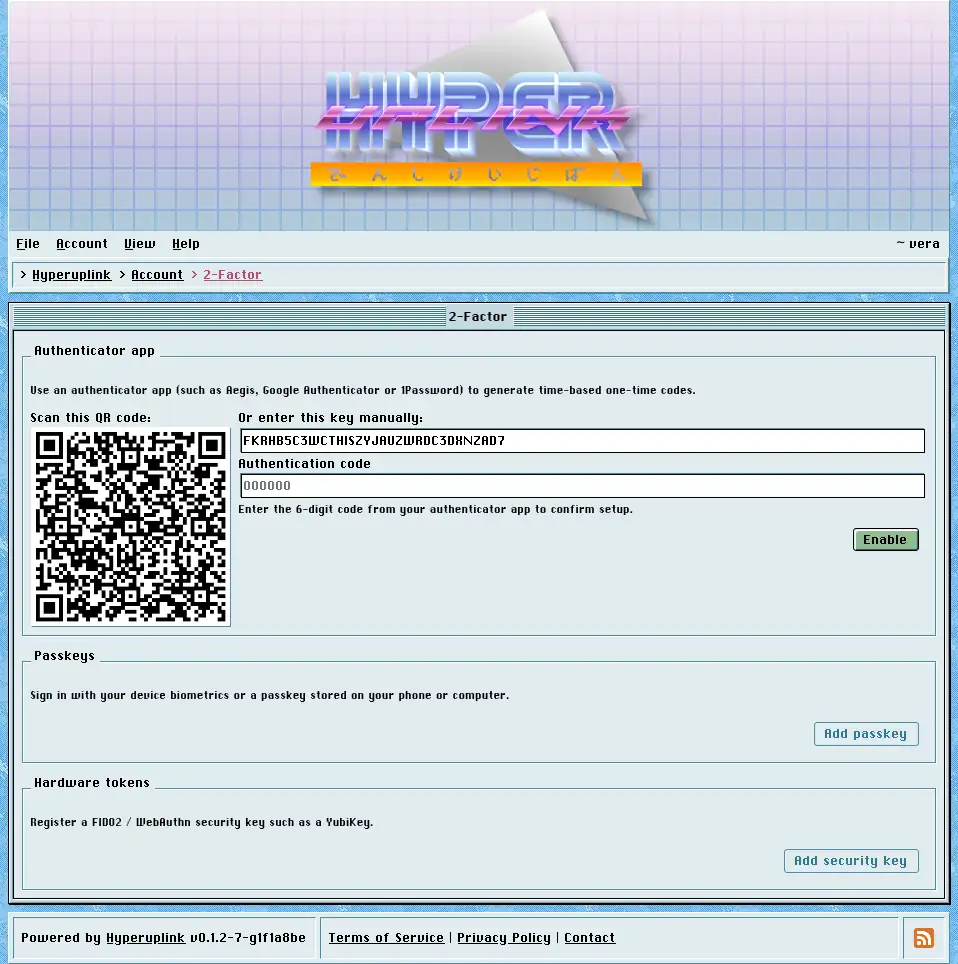

# Two-factor authentication

## Authenticator app

Two-factor authentication uses time-based one-time codes, which is the ordinary
_TOTP_ that _Aegis_, _Google Authenticator_, _1Password_ and every other
authenticator implement, and nothing here is specific to this board.

Turning it on means scanning the QR code with your app, or typing the key next
to it in by hand where scanning is impractical, and then entering the six-digit
code the app produces, to confirm that the app and the board are in sync. The
setup is only stored once that code checks out, which is what keeps an account
from ending up locked behind a secret that never reached an app. The enrollment
expires if you leave it unfinished, and the page then shows a fresh QR code to
start over.

From then on, [signing in]({{ manual "session" }}) asks for a code after the
password, and so does [changing your password]({{ manual "account/password" }}).

Switching it off asks for your password and **not** for a code, because someone
who has your password and your phone can turn it off either way. Someone with
nothing but a borrowed session, however, has neither of the two.

The page itself: [Account → Security → 2-Factor]({{ hrefTo "account/twofactor"
}})
