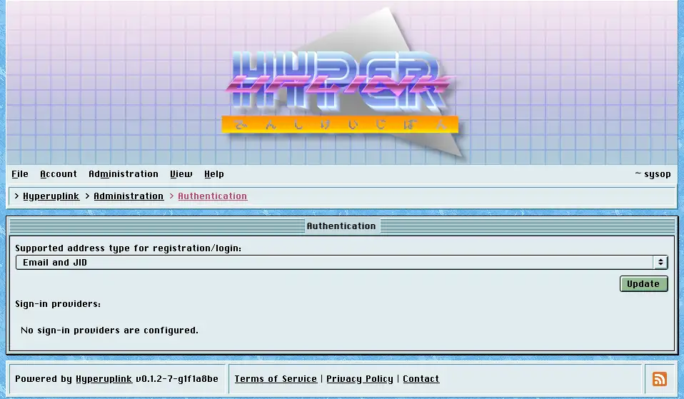

# Authentication

Authentication decides what counts as an address on this board and which outside
services may vouch for a visitor.

## Supported address type

The dropdown decides what [sign-up]({{ manual "session" }}) accepts:

- _Email address only_: the ordinary case.
- _Jabber identifier (JID) only_: makes the board XMPP-native, and confirmation
  tokens as well as notifications are then sent over XMPP.
- _Email and JID_: accepts either of the two, and the sign-up form grows an
  _Address is a JID_ checkbox so that the user says which one they typed.

Pick the one you can deliver to. An address type the board has no
matching [target]({{ manual "admin/comms" }}) for means confirmation tokens that
go nowhere, and an account that cannot be confirmed is an account that cannot be
used.

## Sign-in providers

The providers listed underneath are the OAuth providers from the board's
configuration file, shown with their type, client key and scopes so that you can
see what is loaded. They are read-only here, because they're read from that file
at startup. The secret field holds a placeholder rather than the real secret,
and there is nothing to read out of it.

Where providers are configured, their buttons appear underneath the sign-in and
sign-up forms. The board requires a provider to hand over an email address and
to confirm that it has been verified, and it rejects the sign-in otherwise. That
is the usual reason a configured provider lets nobody in.

The page itself: [Administration → Authentication]({{ hrefTo "admin/auth" }})
