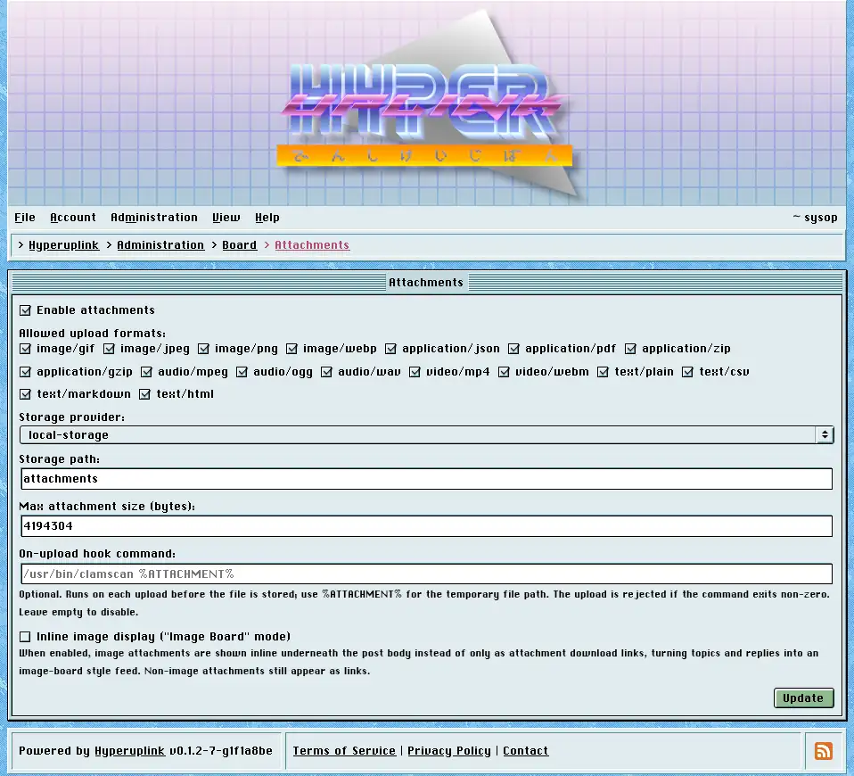

# Attachments

Attachments decides whether your users may upload files at all, which files, and
where those files end up.

- _Enable attachments_: adds the file field to the [editor]({{ manual "newpost"
  }}). With it off there's no field and no uploads.
- _Allowed upload formats_: a list of media types, and it works as a whitelist,
  so a file whose type isn't ticked is refused however it happened to be named.
- _Max attachment size (bytes)_: in bytes, and anything above it is refused.
- _Storage provider_: one of the providers from the board's configuration file,
  and _Storage path_ is the prefix inside it.
- _On-upload hook command_: optional, and runs on every upload before the file
  is stored, with `%ATTACHMENT%` standing in for the temporary file's path. A
  non-zero exit rejects the upload, which is the hook you hang a virus scanner
  off.
- _Inline image display_, which the page itself calls _"Image Board" mode_,
  renders image attachments underneath the post body instead of listing them as
  download links. Non-image attachments stay links either way.

## Public storage and permissions

Where the storage provider you picked serves files publicly, the page says so,
and that warning is worth reading rather than clicking past: attachment read
permissions cannot be enforced against a public provider, because everyone who
guesses the URL downloads the file straight from it without the board ever being
asked.

A board whose categories are all readable by everyone loses nothing by this. A
board with a members-only category, however, needs either local storage or a
private bucket, since the attachments in that category are otherwise protected
by nothing more than the length of their filenames.

The page itself: [Administration → Board Settings → Attachments]({{ hrefTo
"admin/board/attachments" }})
