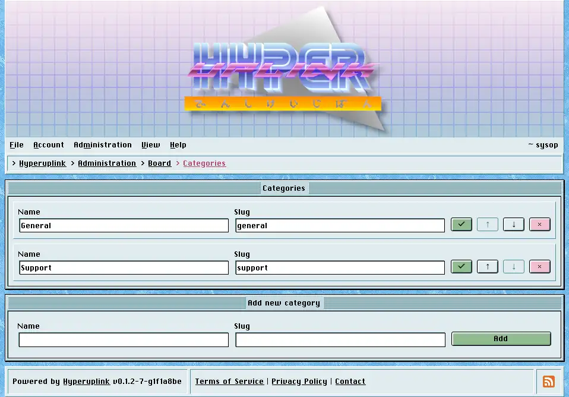

# Categories

Categories are the board's top level, and they matter beyond mere tidiness
because [permissions]({{ manual "admin/permissions" }}) are granted per
category. The question of who may read and write where is answered by how you
cut the board up on this page.

Each row is a category with its name and its slug, and the check button saves
the row. The arrows move a category up and down, which is the order the front
page and the menus list them in, and the disabled arrow at either end tells you
that you've reached the top or the bottom. The `×` button deletes.

The _slug_ is what the category is called in URLs, where it appears with a
leading underscore, so the slug `general` is reached at `/_general`. That
underscore is what keeps a category apart from a user profile at `/~name` and
from the board's own pages, which is why a slug takes only what fits into a URL
and has to be unique.

Deleting a category takes its forums down with it, along with their topics and
the replies in those topics. The `×` removes an entire section of the board
rather than merely the heading it sat under. There is no confirmation
step and it takes effect the moment you click it, so move the forums into
another category first wherever the content is meant to survive.

The delete is a **soft** one, meaning the rows are marked instead of dropped,
and everything marked stops existing as far as the board is concerned: it leaves
the listings and the _Latest Topics_ panel, it stops turning up in search and on
profiles, and its URLs answer with a 404 to everyone who kept the link. What it
does leave behind are the rows themselves, and someone with access to the
database can still bring a category back by hand, however nothing in the
interface will do it for you.

Adding a category takes a name and a slug in the window underneath. A board with
no categories has nowhere to post, and the first thing a new board wants is a
category and then a [forum]({{ manual "admin/board/forums" }}) inside it.

The page itself: [Administration → Board Settings → Categories]({{ hrefTo "admin/board/categories" }})
