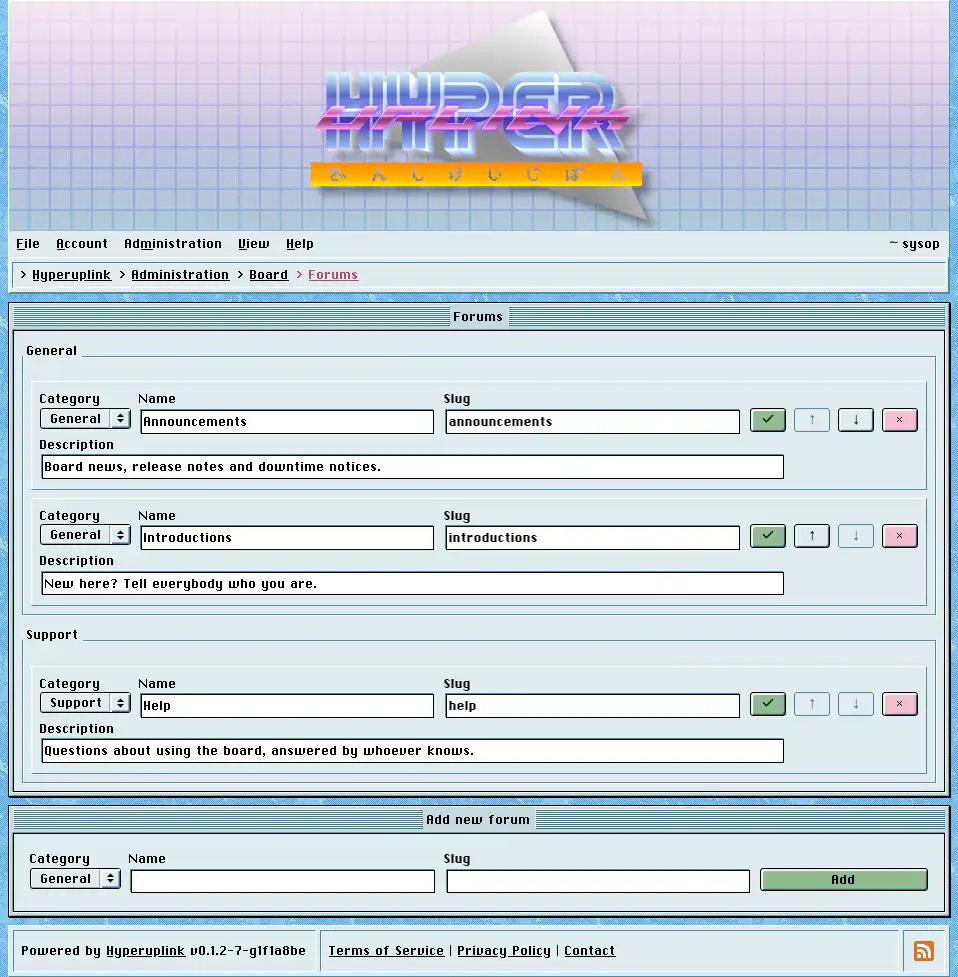

# Forums

Forums are where topics are kept, and each of them belongs to exactly one
[category]({{ manual "admin/board/categories" }}), which is what decides who may
read and write in it.

The page groups the forums under their categories, and each row shows the
forum's name, its slug and its description, with the check button saving the
row, the arrows ordering it within its category and the `×` deleting it. The
arrows stop at the ends of the category the forum belongs to, since ordering
happens per category rather than across the whole board.

The _slug_ is the second segment of the URL, so the forum `announcements` in the
category `general` is reached at `/_general/announcements`, and it has to be
unique across the entire board rather than merely within its category.

Always give a forum a _description_. It is what the category page shows
underneath the forum's name, and a forum that was inserted without one by hand,
through SQL rather than through this page, breaks the row when it is read back,
and the forum then renders as an empty page with no error to explain itself.

Deleting a forum takes its topics with it, along with the replies in them,
whether you delete the forum on its own or delete the
[category]({{ manual "admin/board/categories" }}) it belongs to. The delete is a
soft one, and the rows are marked instead of dropped. Everything marked leaves
the listings, leaves _Latest Topics_, leaves search and the profiles, and
returns a 404 on the URLs it used to have.

Adding a forum takes a name, a slug, a description and the category it goes in.
A board needs at least one forum before anyone can post.

The page itself: [Administration → Board Settings → Forums]({{ hrefTo "admin/board/forums" }})
