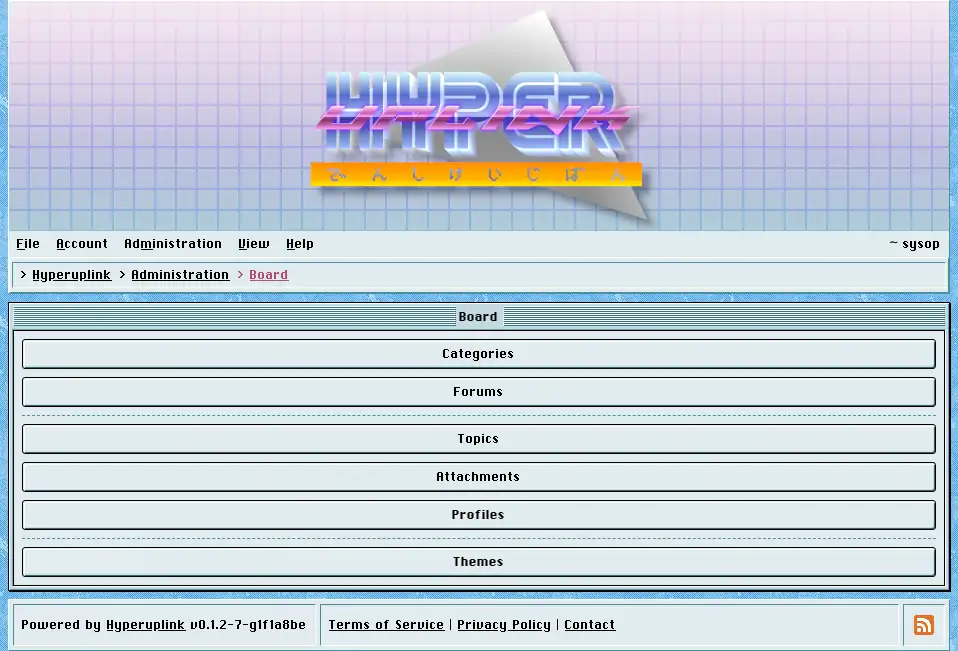

# Board settings

Board settings is where the board's structure and its looks are decided, and the
page itself is an index of the pages underneath it.

## Structure

- [Categories]({{ manual "admin/board/categories" }}) are the top level, and
  they're what [permissions]({{ manual "admin/permissions" }}) are granted
  against.
- [Forums]({{ manual "admin/board/forums" }}) live inside categories and hold
  the topics.

## Posting

- [Topics]({{ manual "admin/board/topics" }}) decides which kinds of topic may
  be started.
- [Attachments]({{ manual "admin/board/attachments" }}) decides whether files
  may be uploaded, which ones, and where they end up.
- [Profiles]({{ manual "admin/board/profiles" }}) decides whether profile
  pictures exist at all.

## Looks

- [Themes]({{ manual "admin/board/themes" }}) picks the theme and the
  colorscheme, and holds the custom banner, favicon and background.

The page itself: [Administration → Board Settings]({{ hrefTo "admin/board" }})
