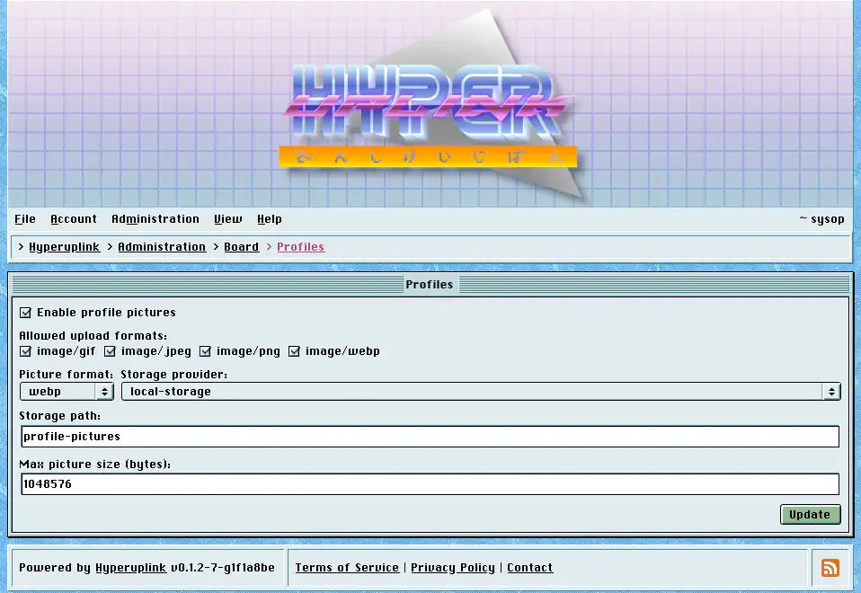

# Profiles

Profiles decides whether users may have a profile picture, and what happens to
the ones they upload.

- _Enable profile pictures_: adds the picture field to
  [Account → Profile]({{ manual "account/profile" }}). With it off, everyone
  keeps the board's default avatar and the field isn't shown.
- _Allowed upload formats_: a whitelist of the image types you accept.
- _Picture format_: what uploads are converted to, meaning _webp_, _png_ or
  _jpg_, so whatever someone uploads leaves as one format at one size rather
  than as a 12-megapixel photograph squeezed into a 64-pixel box.
- _Max picture size (bytes)_: the limit on the upload, defaulting to one
  megabyte.
- _Storage provider_ and _Storage path_ say where the pictures are kept, and the
  provider comes from the board's configuration file.

A profile picture is the one upload that is meant to be public, since it is
shown next to every post its owner writes. The public-storage warning that
matters for [attachments]({{ manual "admin/board/attachments" }}) doesn't apply
in the same way here.

Picture conversion needs _ImageMagick_ on the machine the board runs on, and
that is the one runtime dependency the binary has.

Readers who would rather not see any of this can switch profile pictures off for
their own account under _View_, which changes nothing for anyone else.

The page itself: [Administration → Board Settings → Profiles]({{ hrefTo "admin/board/profiles" }})
