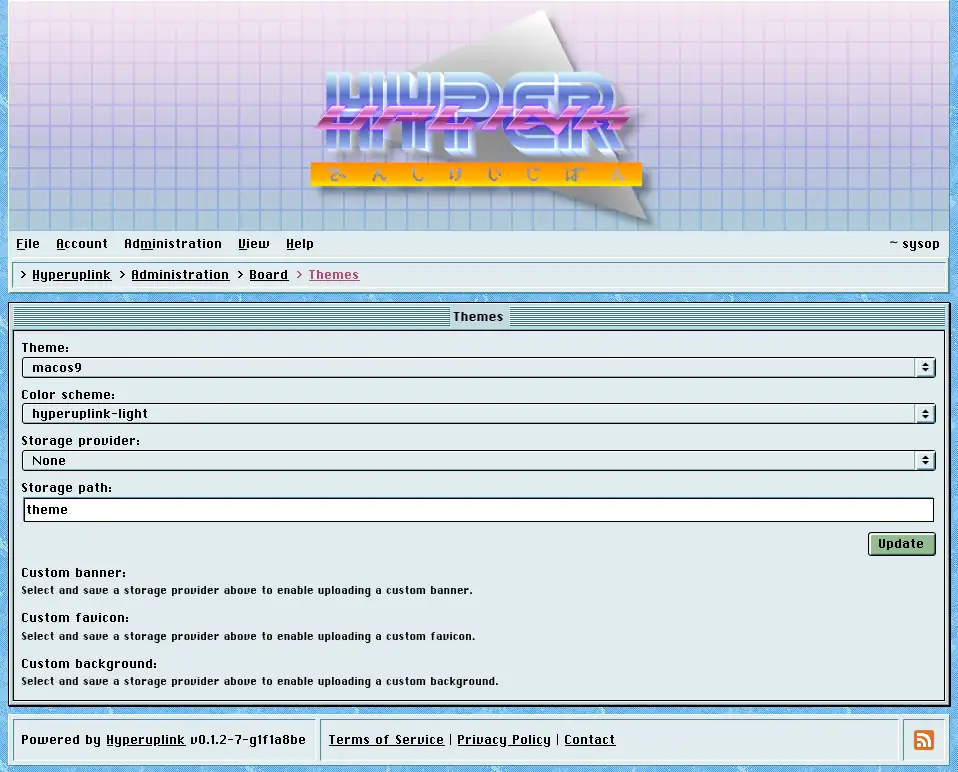

# Themes

Themes is where the board's looks are decided, and the split between the two
dropdowns is what the whole arrangement is built around.

## Theme and colorscheme

A _theme_ decides what a window, a button, a menu and a scrollbar look like, and
the board ships with a whole wardrobe of them: _macos9_, _win3x_, _win9x_,
_winxp_, _cde_, and several that aren't trying to look like anything from 1998
at all.

A _colorscheme_ decides what all of that is painted in, and it is picked
separately, hence a macOS 9 board in _Gruvbox_ is very much a thing you can
have, whether or not it's a thing you should have. A board with nothing picked
runs _macos9_ in _hyperuplink-light_, which is what the screenshots throughout
this manual use.

Both apply to everyone, since this is the board's appearance rather than a
per-account preference. What each reader does control for themselves is the
_View_ menu, meaning the banner, the footer and the profile pictures.

## Custom banner, favicon and background

The three upload fields replace the board's stock banner, its favicon and the
tiled desktop background behind the windows.

All three need a _storage provider_ and a _storage path_ first, and the page
says so until you've picked and saved one, because a file has to go somewhere
before it can be uploaded. The providers come from the board's configuration
file.

One of each may be set at a time, and uploading a replacement means removing
what's there first. _Remove_ puts the stock article back rather than leaving you
with nothing.

The page itself: [Administration → Board Settings → Themes]({{ hrefTo "admin/board/themes" }})
