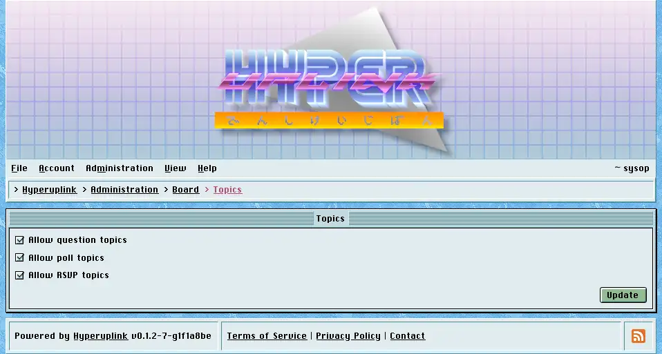

# Topics

Topics decides which kinds of topic your users may start.

_Allow poll topics_ adds the _Poll_ option to the
[editor]({{ manual "newpost" }}), and with it the option fields and the end
date.

Turning polls off does **not** retire the polls that were already posted, and
the topics carrying one keep showing it and keep taking votes. The setting only
decides what may be started from now on, however, and not what already exists.

The page itself: [Administration → Board Settings → Topics]({{ hrefTo "admin/board/topics" }})
