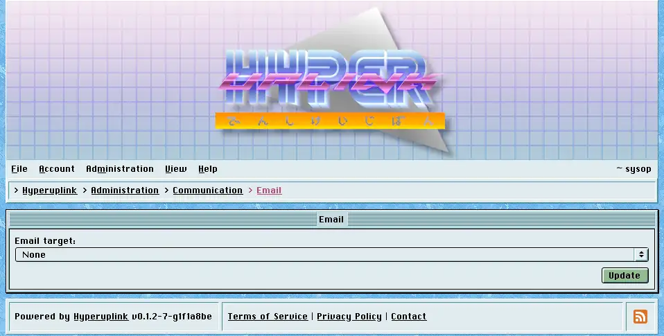

# Email

_Email target_ lists every target of type email from the board's configuration
file, plus _None_, and picking one is all this page changes. From then on,
confirmation tokens and reply notifications aimed at email addresses go out
through that target.

The SMTP server, the authentication type, the TLS policy, the username, the
sender address and the sender name underneath are all shown read-only, because
they are read from the configuration file at startup and this page reports what
got loaded rather than editing it. The password field is
filled with a placeholder instead of the real password, and there is nothing to
read out of it.

Targets of type debug are listed here as well, and they write the message to a
file on disk instead of sending it. That is what you want on a development
board, however **never** on a live one.

The page itself: [Administration → Communication → Email]({{ hrefTo "admin/comms/email" }})
