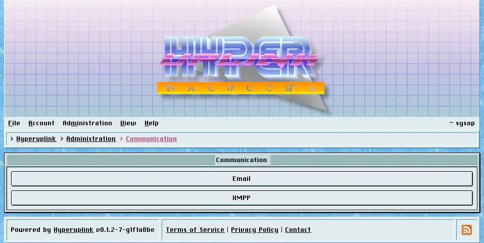

# Communication

The board sends two kinds of message, namely the confirmation token a new
account needs and the notification about a reply, and it sends them over email
or over XMPP depending on what the recipient's address is.

_Targets_ are defined in the board's configuration file, each with an ID, a type
and its credentials, and these two pages are where you decide which of those
targets is used for which kind of message:

- [Email]({{ manual "admin/comms/email" }}) picks the target for email
  addresses.
- [XMPP]({{ manual "admin/comms/xmpp" }}) picks the target for JIDs.

The split matters because the address decides the route. A user who signed up
with a JID is written to over XMPP whatever the email target says. A board that
accepts both address types needs both targets pointed at something, while a
board that accepts only one needs only that one.

Where no target is picked, the board falls back to a debug target of the
matching kind wherever the configuration file declares one. Where it declares
none, which is how a live board should be configured, the board sends nothing at
all. A [sign-up]({{ manual "session" }}) then produces an account whose token
never arrives, leaving it to you to confirm that account by hand in
[Users]({{ manual "admin/users" }}), which is workable on a closed board and a
nuisance on an open one.

The page itself: [Administration → Communication]({{ hrefTo "admin/comms" }})
