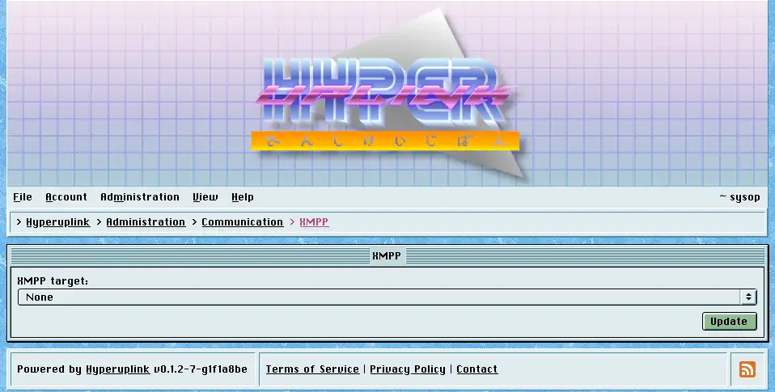

# XMPP

_XMPP target_ works exactly like the [email]({{ manual "admin/comms/email" }})
one does, listing the targets of type XMPP from the configuration file plus
_None_, and the target you pick sends confirmation tokens and reply
notifications aimed at JIDs. Messages sent over XMPP are plain _Markdown_, while
the email target sends a formatted message, since a chat window is a poor place
for a rendered newsletter.

The server, username and password underneath are read-only for the same reason
they are on the email page, and the password is a placeholder rather than the
real one.

## Skip certificate verification

_Skip certificate verification_ reports whether the selected target was
configured with `InsecureSkipVerify`. Where it says true, anyone able to
intercept traffic between the board and the XMPP server can present a
certificate of their own and
then read or change everything crossing that connection, the account credentials
included.

The flag exists so that a development server holding a self-signed certificate
can be reached at all. [Health]({{ manual "admin/health" }}) raises it as an
issue for exactly this reason, and a live board should have it off.

Connections are made lazily and aren't fatal. A board whose XMPP server is down
still starts and still serves, and it fails to deliver until the server comes
back.

The page itself: [Administration → Communication → XMPP]({{ hrefTo "admin/comms/xmpp" }})
