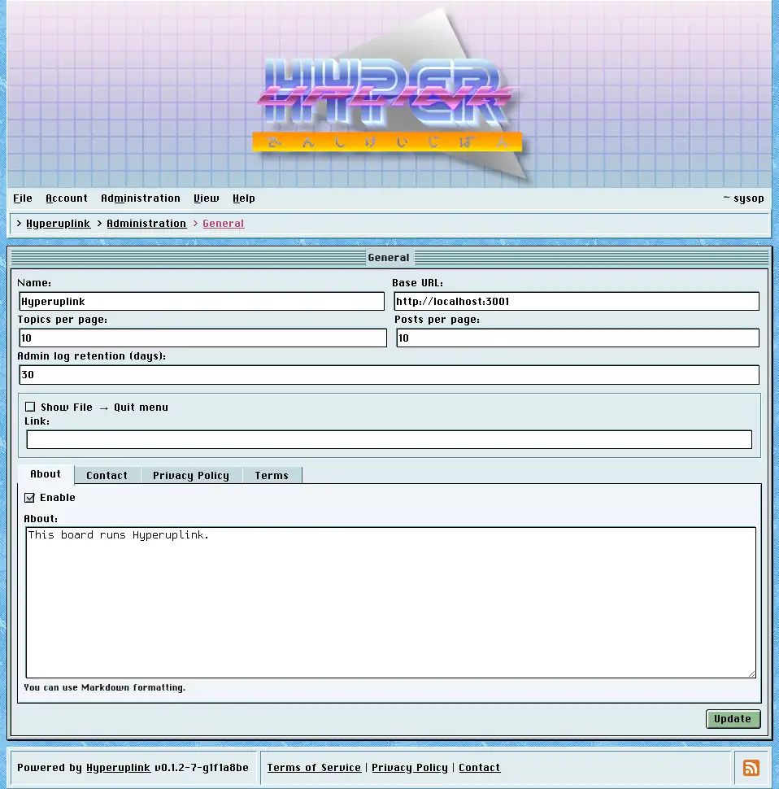

# General

General holds the handful of settings that describe the board as a whole.

## Configuration

- _Name_: the board's name, and what the browser tab, the page titles and the
  social preview cards say.
- _Base URL_: the address the board is reached at, used wherever an absolute URL
  is unavoidable, meaning the links inside notification emails and XMPP
  messages, as well as the canonical and preview-image URLs in the page head.
  Getting it wrong doesn't break the board, however it does break the links in
  the messages the board sends out, and those are the links nobody ever tests.
- _Topics per page_ and _Posts per page_: how long a forum listing and a topic
  get before they're paged. Both default to 10.
- _Admin log retention (days)_: how long entries in
  [Logs]({{ manual "admin/logs" }}) are kept before a nightly job deletes them.
  Defaults to 30.
- _Show File → Quit menu_: adds a _Quit_ entry to the _File_ menu pointing at
  the _Link_ underneath it, which is there for boards that live inside something
  else and want a way back out. The link is required once the checkbox is on.

## The documentation pages

The four tabs at the bottom are the About, Contact, Privacy Policy and Terms
pages. Each of them has a checkbox that turns it on and a text area holding its
content, which is _Markdown_, and a page that is enabled while empty is refused
instead of published blank.

An enabled page appears in the _Help_ menu, and Terms, Privacy Policy and
Contact additionally appear in the footer. A disabled page leaves the menus and
answers with a 404, and nobody gets to read a policy you took down by digging
the URL out of their history.

The page itself: [Administration → General]({{ hrefTo "admin/general" }})
