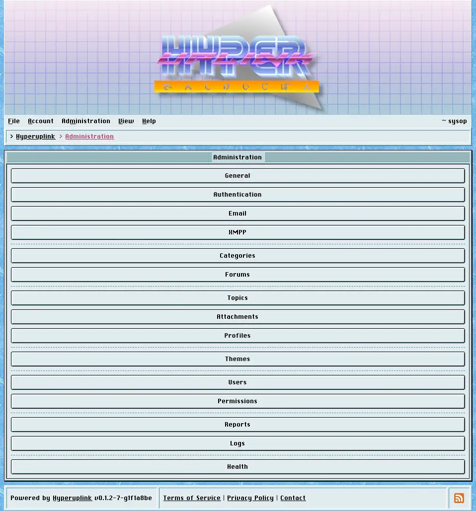

# Administration

The _Administration_ menu appears for accounts with the admin role and holds
everything that configures the board through its interface. An account becomes
an administrator by having its address listed under `PromoteAdmin` in the
board's configuration file at the time it signs up, which is the one part of all
this that happens outside the interface and that is covered in the repository
rather than here.

Everything on these pages is stored in the database rather than in the
configuration file. It takes effect immediately and survives a restart.
What lives in the configuration file instead is the machinery the board needs
before it can read a database at all, meaning the database itself, the cache,
the storage providers and the delivery targets, and the admin pages then point
at those by name.

## The board

- [General]({{ manual "admin/general" }}) is the board's name, its base URL, the
  page sizes, and the About, Contact, Terms and Privacy pages.
- [Board settings]({{ manual "admin/board" }}) covers categories, forums, topic
  types, attachments, profiles and themes.

## People

- [Users]({{ manual "admin/users" }}) confirms, bans and deletes accounts.
- [Permissions]({{ manual "admin/permissions" }}) decides who may read, write
  and moderate where.

## Doors in

- [Authentication]({{ manual "admin/auth" }}) decides what counts as an address
  and which external providers may sign people in.
- [Communication]({{ manual "admin/comms" }}) picks which configured target
  carries email and which one carries XMPP.

## Watching the place

- [Reports]({{ manual "admin/reports" }}) is what your users flagged.
- [Logs]({{ manual "admin/logs" }}) is what your administrators did.
- [Health]({{ manual "admin/health" }}) is what the board thinks is wrong with
  itself.

The page itself: [Administration]({{ hrefTo "admin" }})
