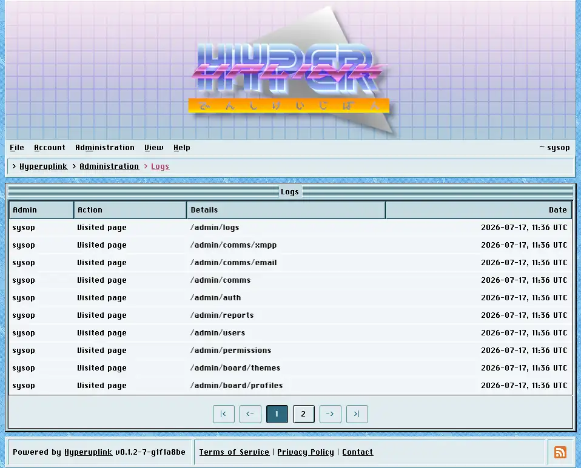

# Logs

Logs is the audit trail of what the administrators did, and it exists so that a
board with more than one administrator can answer the question of who changed
the thing that broke.

Each row names the administrator, the action, the details and the time. Two
actions are recorded today: _Updated settings_, which is written whenever an
admin page saves, and _Visited page_, which is written whenever an admin page is
opened.

The details column names the fields that were changed rather than the values
they were changed to. The log tells you that someone edited the SMTP password
without itself becoming a second place where that password is written down.

Entries are deleted by a nightly job once they're older than the _Admin log
retention (days)_ set in [General]({{ manual "admin/general" }}), which defaults
to 30 days. That job is internal to the board and runs whether or not anyone is
watching, and on a board running as several instances it still runs once rather
than once per instance.

Ordinary users and their posts are not in here. This is a record of
administration rather than of the board's traffic, and reading it is not a way
of finding out who read what.

The page itself: [Administration → Logs]({{ hrefTo "admin/logs" }})
