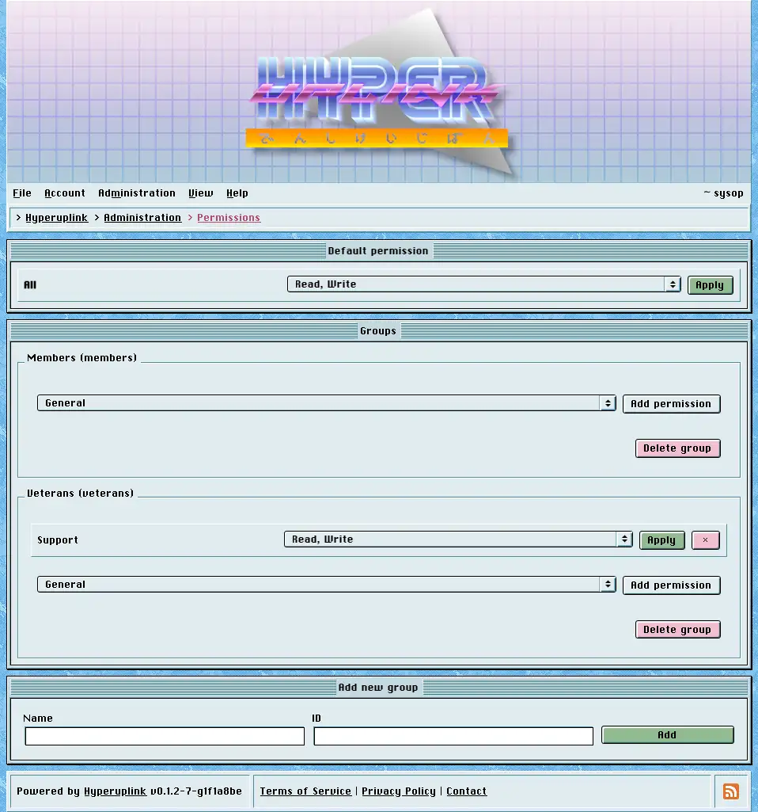

# Permissions

Permissions decide who may read, write and moderate in which
[category]({{ manual "admin/board/categories" }}), and the whole thing is built
out of two ideas: a default that applies to everyone, and groups that raise that
default for their members.

## Levels

There are four of them and they nest, meaning each one includes the one before
it:

- _None_: cannot see the category at all, and it isn't listed for them in the
  first place.
- _Read_: may read.
- _Read, Write_: may read and post.
- _Read, Write, Moderate_: may read, post and moderate what is in there.

## Default permission

The top window sets the level for _All_ categories and for everyone who isn't
lifted above it by a group, meaning guests and signed-in users alike. This is
the setting that decides what kind of board you're running:

- _Read_: a public board that people sign up to post in.
- _Read, Write_: a public board that everyone may post in.
- _None_: a board that shows nothing to anyone until a group says otherwise,
  which is where you start when the board is meant to be private.

## Groups

The windows underneath are the groups, each with the categories it grants
something in, and users are put into groups from their
[profile]({{ manual "user" }}) rather than from here. A group with no members
grants nothing to nobody, and a user in no groups gets the default and nothing
more.

Adding a group takes an ID and a name, the ID being what the permission rows
point at, and _Add permission_ then adds a category row to that group. A
category that already has a row in a group cannot be added a second time, and
the page shows a message once every category is mapped.

## Resolution

A user's level in a category is the **highest** of the default and of every
group they're in, which has one consequence worth being clear about: a group can
only ever raise access and **not** lower it. A group set to _Read_ in a category
whose default is _Read, Write_ changes nothing at all for its members, since
they already had more than it grants.

Hence a private category is built by setting the default to _None_ and granting
the group what it needs, rather than by leaving the default open and trying to
exclude one group. There is no deny rule.

Administrators aren't resolved through any of this and are never denied access.
An admin account reads and writes everywhere, whatever the table is set to.

The page itself: [Administration → Permissions]({{ hrefTo "admin/permissions" }})
