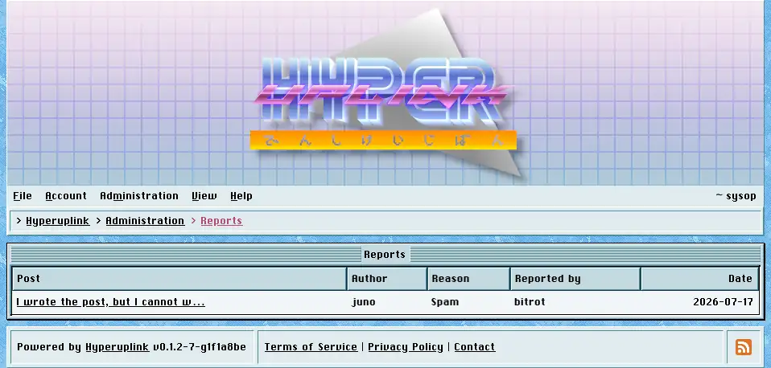

# Reports

Reports is where the `!` button your users press ends up.

Each row carries the post that was reported, its author, the reason given, who
reported it and when, and the list is paged like the rest of the board. The
reason is one of _Spam_, _Misconduct_ or _Illegal content_. A board that nobody
has reported anything on says so instead of showing an empty table.

The post links through to where it sits, which is what makes the page useful,
because the reason on its own tells you how someone felt rather than what was
actually written.

A user may report a given post once. Five rows against one post mean five
people and **not** one person clicking five times.

The page reports and it does not act. What you do about a report is done
elsewhere, from the author's [profile]({{ manual "user" }}) or from
[Users]({{ manual "admin/users" }}), and a report stays listed afterwards rather
than being cleared.

The page itself: [Administration → Reports]({{ hrefTo "admin/reports" }})
