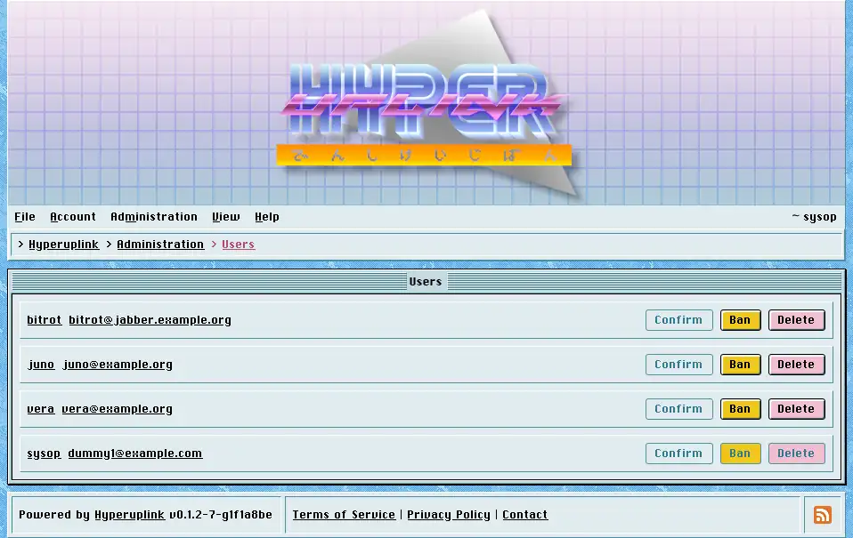

# Users

Users lists every account with its username, its address and the four things you
can do to it.

The state of an account is carried by how its name and address are styled, and
an account that is unconfirmed, banned or deleted reads differently from an
ordinary one without needing a column of its own.

- _Confirm_: activates an account without the user entering the token they were
  sent, which is what you reach for when the confirmation never arrived and the
  address is one you trust. Disabled on accounts that are confirmed already.
- _Ban_ stops the account from being used, and _Unban_ puts it back.
- _Delete_ removes the account.

All four are disabled on your own account, so that an administrator cannot ban
or delete themselves by clicking the wrong row.

The same four actions sit on each user's [profile]({{ manual "user" }}), under
_Administrate_, next to the group checkboxes that decide what that account may
do. The profile is, however, the better place to work from while you're reading
someone's posts and deciding what to do about them.

An account becomes an administrator through the `PromoteAdmin` list in the
board's configuration file at sign-up and **not** through this page, and there
is no button here that grants the admin role.

The page itself: [Administration → Users]({{ hrefTo "admin/users" }})
