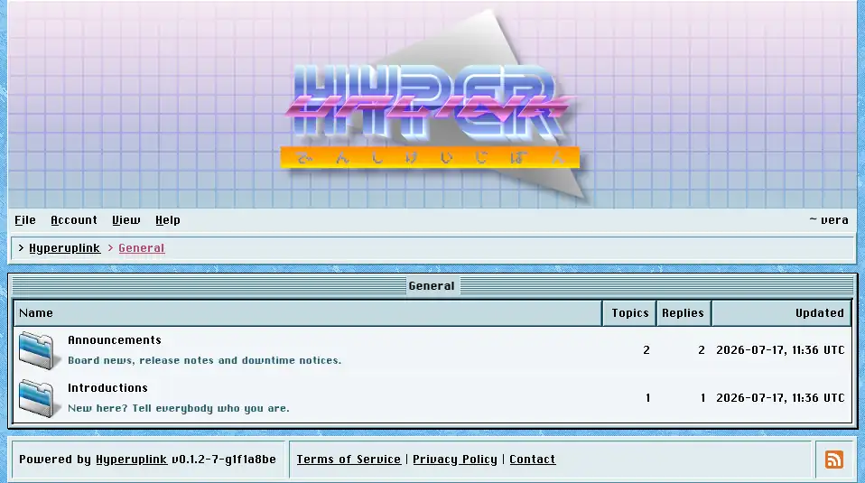
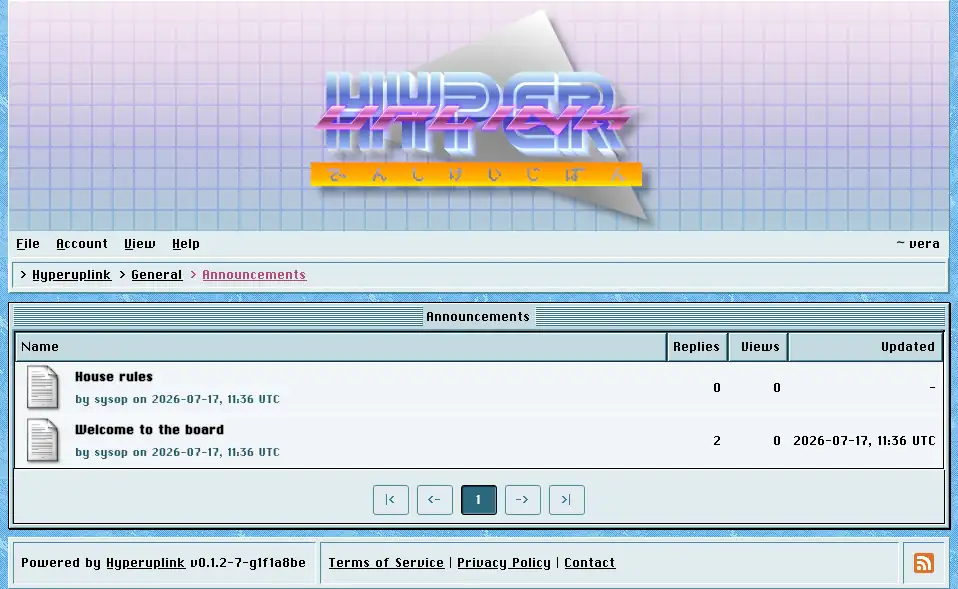
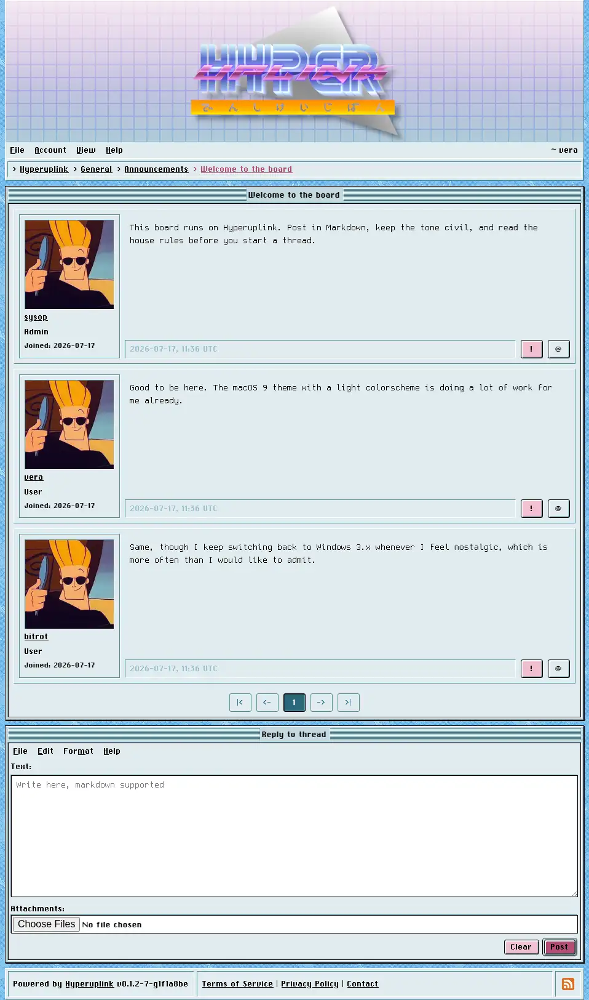
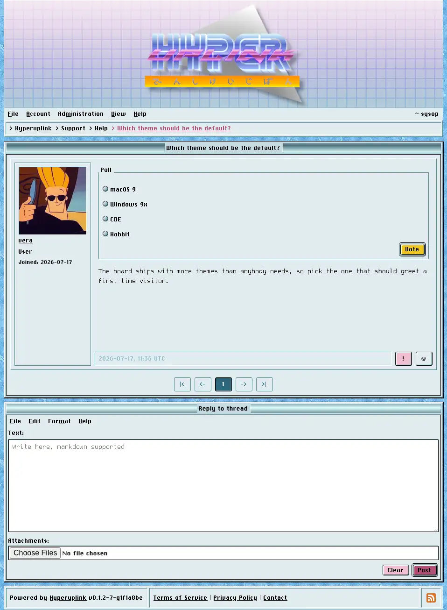
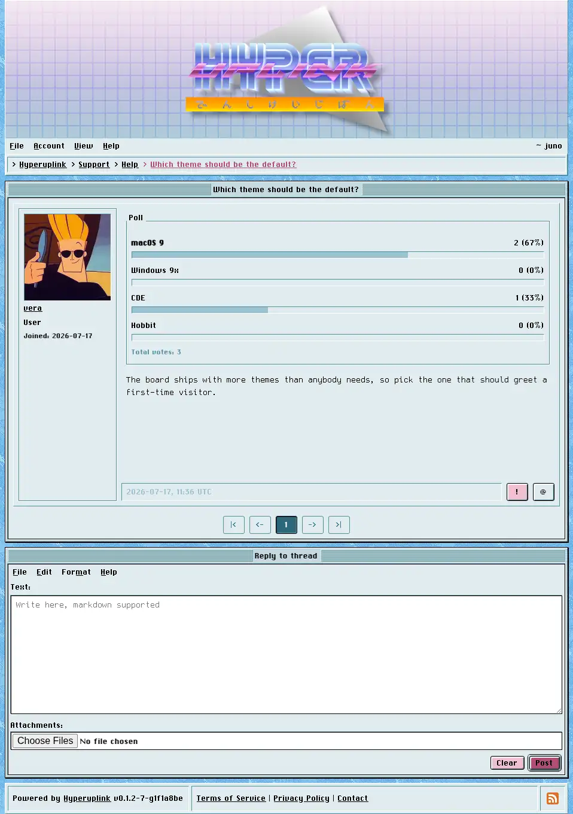

# Reading the board

The board is three levels deep: _categories_ hold _forums_, forums hold
_topics_, and a topic is the first post plus every reply underneath it. The
front page lists the latest topics across everything you're allowed to read,
followed by each category with its forums. The whole board fits on one screen
until it outgrows it.

## Categories and forums

A category page lists the forums inside it, each with its description, its topic
and reply counts, and the time it was last written in. Categories you have no
read permission for are, however, not listed at all, instead of being listed and
then denied. A board can hold a members-only category without showing it to
everyone who visits.

A forum page lists its topics, newest activity first, with pinned topics held at
the top. How many topics fit on a page is set by the administrator in
[General]({{ manual "admin/general" }}), and the pager underneath covers the
rest.

## Topics

A topic shows the first post and then the replies in order, each of them with
the author's profile picture, username, role, groups and join date down the
side, and with the author's signature underneath the text wherever they set one.
Attachments appear under the post, either as download links or as images
rendered inline, depending on whether the administrator switched on
[inline image display]({{ manual "admin/board/attachments" }}).

Two buttons appear at the bottom right of every post while you're signed in. The
`!` button [reports the post]({{ manual "report" }}) to the administrators, and
the `@` button starts a reply aimed at that particular post, which is covered
in [writing]({{ manual "newpost" }}).

## Polls

Where the administrator allows poll topics, a topic can include a poll, and that
poll is shown above the post text in a fieldset of its own.

You get one vote and it is final, and the radio buttons and the _Vote_ button
are all you see until you've used it. This is deliberate: a poll whose votes can
be changed after the fact measures how often people change their minds rather
than what they think of the question.

Once you have voted, and from then on, the poll shows the counts, the
percentages and the total, with your own choice marked. Everyone who cannot vote
sees those results straight away, meaning guests, users without write permission
in that category, and eventually everyone, once a poll that the author gave an
end date has passed it.
