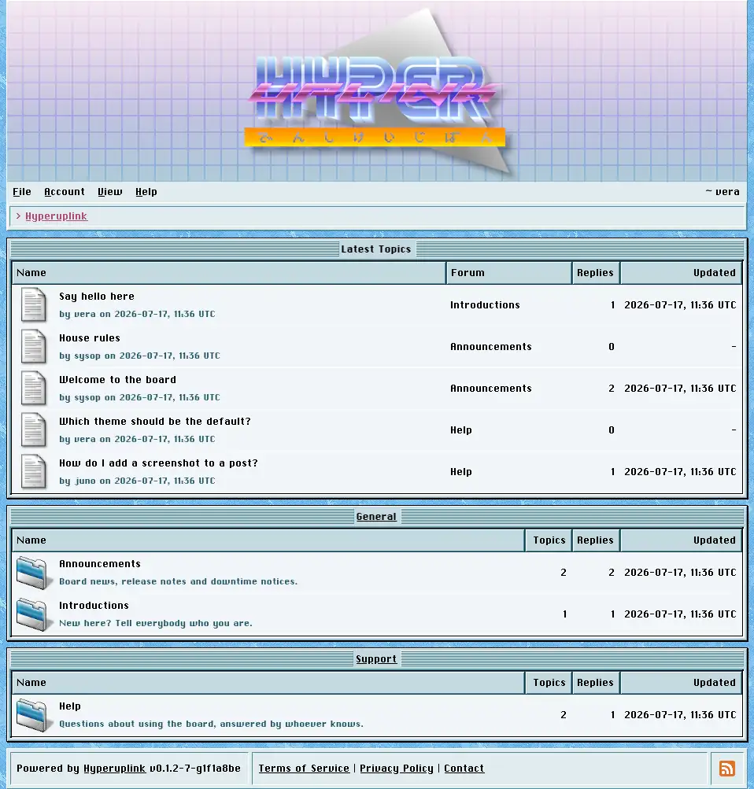

# Manual

Hyperuplink is a modern internet bulletin board reimagined as a single,
dependency-free binary, supporting PostgreSQL clusters and without any runtime
dependencies, 100% JavaScript free, and based on modern HTML5/CSS.

This manual covers the board as you use it, through its interface, and
it is written for the people who post as well as for the people who run the
place. Hosting, configuration files and deployment are **not** covered here,
because those are documented in the repository and on
[hyperup.link](https://hyperup.link), and everything below assumes the board is
already running and that you're looking at it.

## Window

Every page is a window, or a stack of them, and each window has a title bar
naming its contents. The menu bar is underneath the banner and is the main
way around the board, and the breadcrumb trail underneath it shows where you are
and lets you navigate back up. Once you're signed in, your username appears at
the right of the menu bar and links to your [profile]({{ manual "user" }}).

Themes decide what the board looks like and colorschemes decide what color it is
painted in. The same board can be a macOS 9 lookalike, a Windows 3.x program, or
something else entirely, without a single line of markup changing.

## Menu bar

_File_ holds _New_ for starting a topic, _Search_ for the board-wide search, and
_Quit_, which is a link out of the board wherever the administrator pointed it
somewhere. _New_ stays grayed out for as long as you have write permission
nowhere.

_Account_ is where you sign in or sign up while you're still a guest, and where
your profile, settings, password, two-factor setup and [API keys]({{ manual
"account/api" }}) live once you have an account. _Administration_ shows up for
administrators only and holds everything under [Administration]({{ manual
"admin" }}). _Help_ holds this manual, plus the terms, privacy policy, contact
and about pages wherever the administrator filled them in.

_View_ holds three toggles, _Banner_, _Footer_ and _Profile Pictures_, and they
change how the board is drawn for your account only. They're stored against the
account rather than the browser, and they follow you from machine to machine.
They change nothing for anyone else.

## For users

- [Signing up and signing in]({{ manual "session" }})
- [Reading the board]({{ manual "categories" }})
- [Writing topics and replies]({{ manual "newpost" }})
- [Searching]({{ manual "search" }})
- [Reporting a post]({{ manual "report" }})
- [Profiles]({{ manual "user" }})
- [Your account]({{ manual "account" }})

## For administrators

- [Administration]({{ manual "admin" }})
