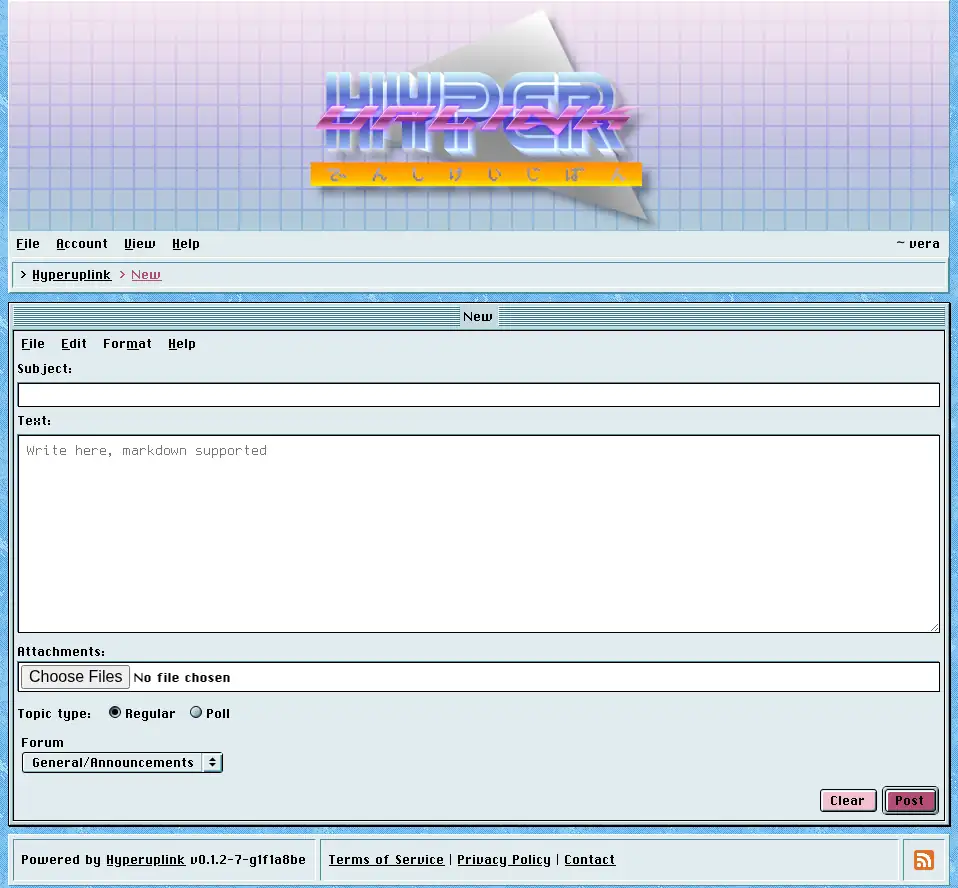
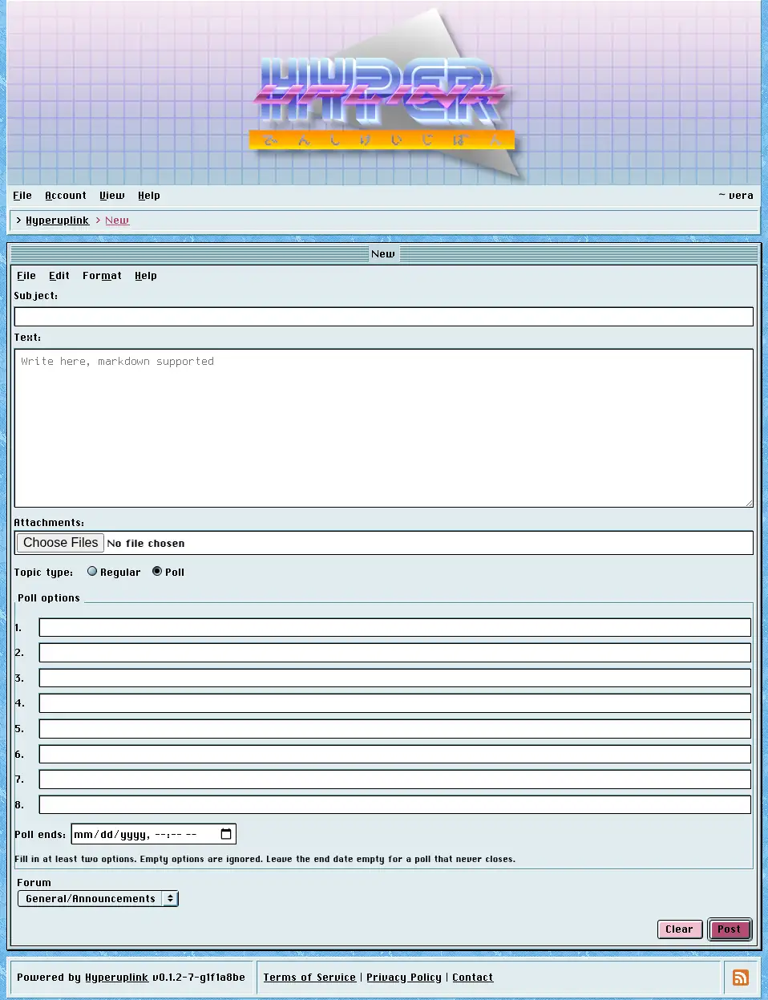

# Writing topics and replies

_File_ → _New_ opens the editor. If you opened it from within a forum then that
forum is already selected and locked, and from anywhere else you pick the forum
from the dropdown at the bottom. The menu entry stays grayed out for as long as
you have write permission nowhere, which saves you from filling in a form that
the board was always going to refuse.

## The editor

A topic needs a subject and some text, a reply needs only the text, and both are
written in _Markdown_. Headings, emphasis, lists, links, tables, task lists,
strikethrough and fenced code blocks with syntax highlighting all work.
Raw HTML is stripped instead of being rendered, which is how one user's post is
kept from rewriting another user's page.

The _File_, _Edit_, _Format_ and _Help_ menus above the text area are part of
the editor window. Since the board runs without JavaScript, formatting is
something you type rather than something a toolbar does for you, and the hint
underneath the field says so.

## Attachments

Where the administrator enabled attachments, a file field sits under the text
area and takes several files at once. What you may upload, and how large it may
be, is set in [Attachments]({{ manual "admin/board/attachments" }}). A file that
is too large, of a type that isn't allowed, or a duplicate of something you
already uploaded, is refused with a message saying which of the three it was.

Image attachments show up as links underneath the post. Where the administrator
turned on inline image display, however, they're rendered under the post body
and the board reads like an image board.

## Polls

Where [poll topics]({{ manual "admin/board/topics" }}) are allowed, a new topic
can be a poll instead of a regular one, and choosing _Poll_ under _Topic type_
reveals the option fields. This works without JavaScript, and the fields are
always in the page. The radio button merely decides whether you get to see
them.

A poll takes between two and eight options, each at most 78 characters, and
empty options are ignored instead of counted, so you fill in as many as you need
and leave the rest alone. _Poll ends_ is optional, and a poll without an end
date never closes. Where you do set one, it is read in your own timezone,
meaning the one you picked in [Settings]({{ manual "account/settings" }}).

## Replying

The reply editor sits at the bottom of every topic you're allowed to write in.
The `@` button on a post replies to that post specifically rather than to the
topic as a whole, and the reply then hangs off the post you aimed it at.

Everyone who wrote in a topic is notified when a new reply lands, provided they
left [reply notifications]({{ manual "account/profile" }}) on and the board has
a way of reaching them. Nobody is notified about their own replies.

The page itself: [File → New]({{ hrefTo "new" }})
