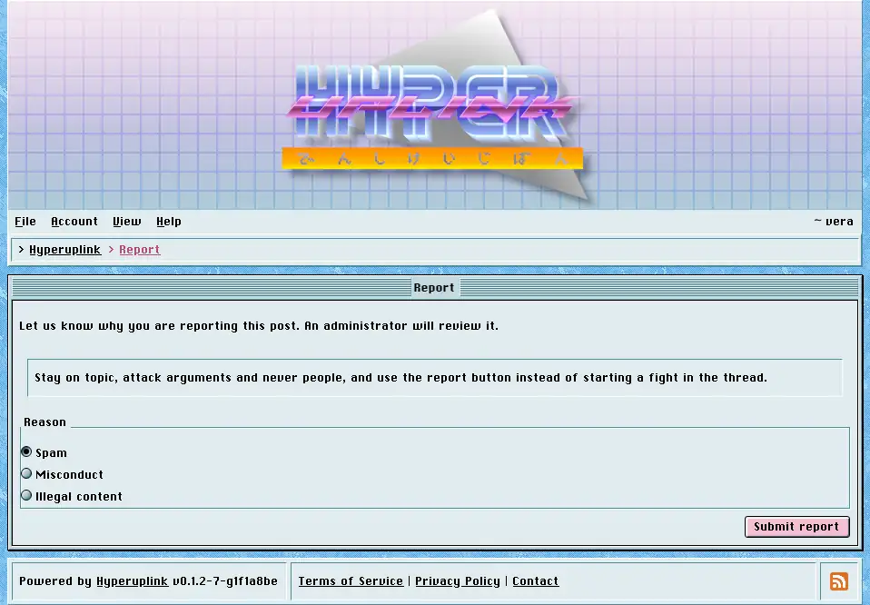

# Reporting a post

The `!` button at the bottom of every post reports it to the administrators, and
it is on topics and on replies alike for everyone who is signed in.

The post you're reporting is quoted back at you, which matters because the
button is small and is right next to the reply button, and then you pick a
reason: _Spam_, _Misconduct_ or _Illegal content_. Submitting takes you back to
the post you came from.

You may report a given post once, and a second attempt is rejected with a
message saying so, because a report is a flag for an administrator to look at
rather than a vote to be stacked.

What happens next is up to whoever runs the board. Reports land in
[Reports]({{ manual "admin/reports" }}), where an administrator sees the post,
its author, who reported it and why.
