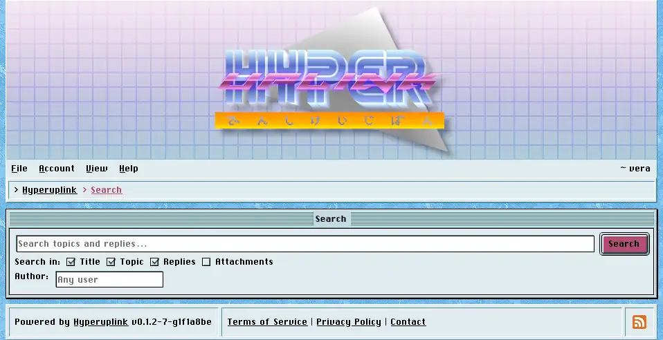

# Searching

_File_ → _Search_ searches the board, and it searches only what you're allowed
to read. Results never leak the existence of a category your account has no
permission for.

The checkboxes under the field decide where the term is looked for, and they're
independent of each other. A term can be matched against topic titles, against
the text of topics, against the text of replies, against attachment filenames,
or against any combination of those. _Author_ narrows the whole
search down to one user, and left empty it means everyone.

Results are listed with their type, meaning whether the hit was a topic or a
reply, along with who wrote it and when. Each result links to the post itself
rather than to the topic it belongs to, and a reply found on the fourth page of
a long thread opens right at that reply.

The result list is paged like the rest of the board, at the number of topics per
page the administrator set in [General]({{ manual "admin/general" }}).

The page itself: [File → Search]({{ hrefTo "search" }})
