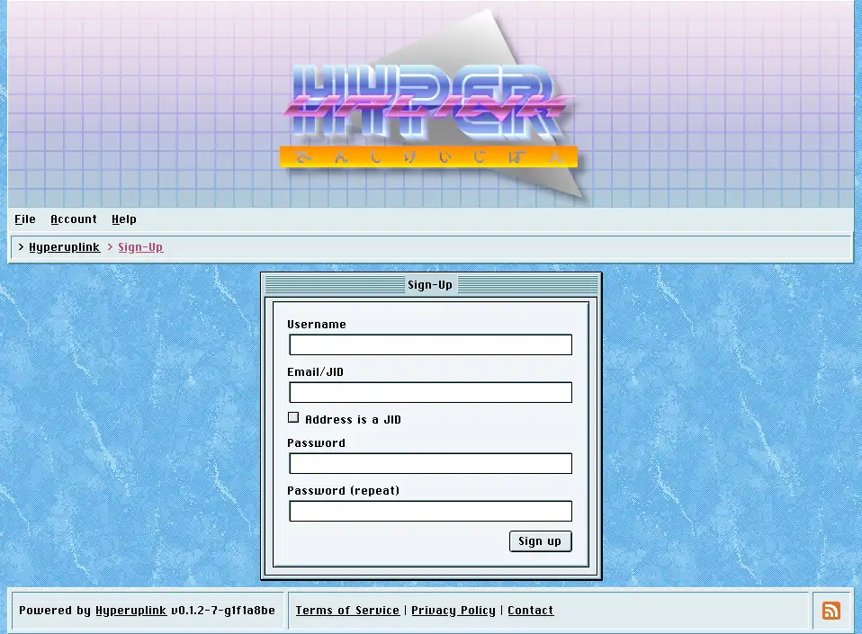
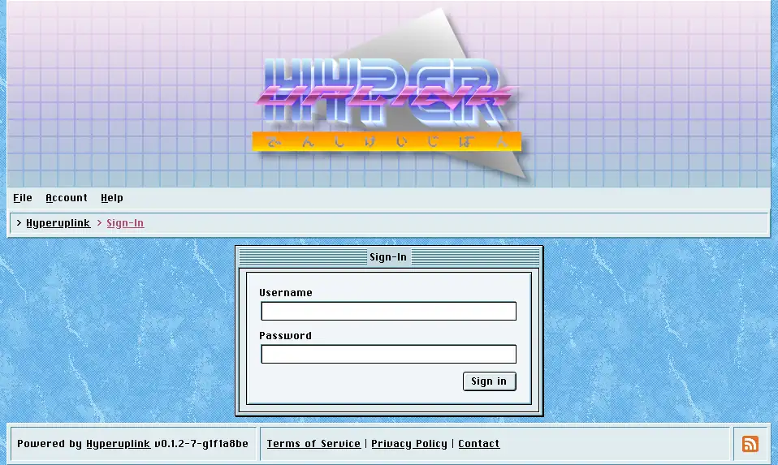

# Signing up and signing in

Guests can read a board, however posting, voting and reporting all require an
account, and the _Account_ menu is where you get one.

## Signing up

Sign-up asks for a username, an address and a password twice, and what counts as
an address depends on what the administrator allowed in
[Authentication]({{ manual "admin/auth" }}): an email address, a _JID_ (an XMPP
address), or either one, in which case the _Address is a JID_ checkbox tells the
board how to read what you typed.

Once the form is submitted the board sends a confirmation token to the address
you gave it, and the account remains unconfirmed until you enter that token on
the confirmation page. If the token never turns up, and email being email it
sometimes doesn't, _Resend confirmation_ sends another one.

On a board whose administrator has configured neither email nor XMPP delivery
the token unfortunately goes nowhere at all, and the account then waits until an
administrator confirms it by hand in [Users]({{ manual "admin/users" }}). Hence
an open board wants delivery working before it wants sign-ups.

## Signing in

Sign-in takes the username and the password, and never the address. The address
is only ever used for confirmation and for notifications.

Where the administrator configured OAuth providers, buttons for them appear
underneath the form. Signing in through one of them requires the provider to
hand over an email address **and** to confirm that it has been verified, and a
provider that does neither is refused, because the board would otherwise be
trusting an address that nobody ever checked.

## Two-factor authentication

If you turned on
[two-factor authentication]({{ manual "account/twofactor" }}), signing in stops
after the password and asks for the six-digit code from your authenticator app
before it finishes. Too many wrong codes in a row abandon the attempt and send
you back to the start.

## Signing out

_Account_ → _Sign-Out_ ends the session in the browser you clicked it in, and
where you signed in through an external provider it also closes the board's side
of that provider's session. Other browsers you're signed in with are left alone,
and a session you abandoned on a machine you no longer have stays open until
it expires.
