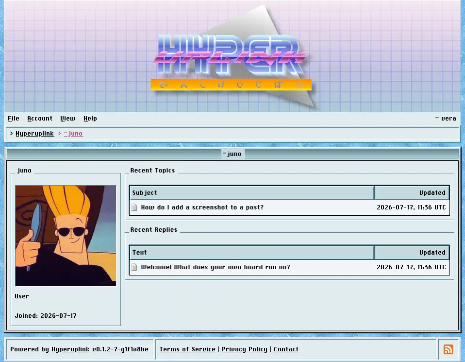

# Profiles

Every username on the board links to that user's profile, which is at `/~`
plus the username, so `/~vera` is vera's. Your own is reachable from your name
at the right of the menu bar.

The panel on the left shows the profile picture, the role, the groups the user
belongs to, the date they joined, and their signature wherever they wrote one.
The role is either _Guest_, _User_ or _Admin_. The two lists on the right show
their recent topics and their recent replies, each linking to the post.

Administrators see two more panels here. _Group membership_ is a checkbox per
group and is where a user is put into or taken out of a group, which is what the
[permissions]({{ manual "admin/permissions" }}) then act on. _Administrate_
holds the same confirm, ban, unban and delete actions as
[Users]({{ manual "admin/users" }}), and all four are disabled on your own
account, so that an administrator cannot ban or delete themselves after
misreading which profile they had open.
